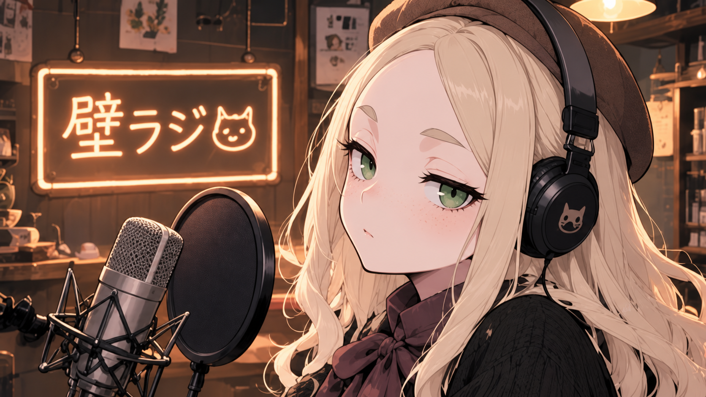
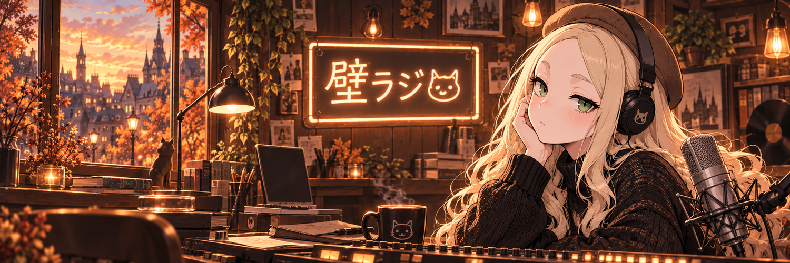
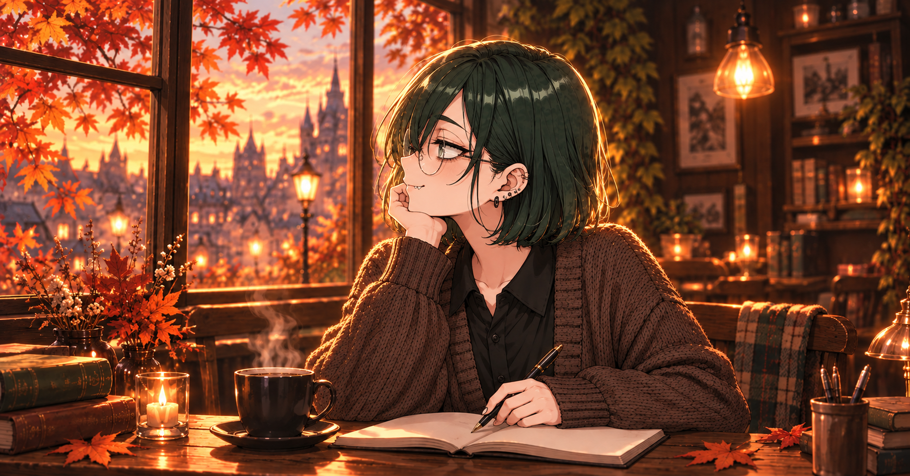
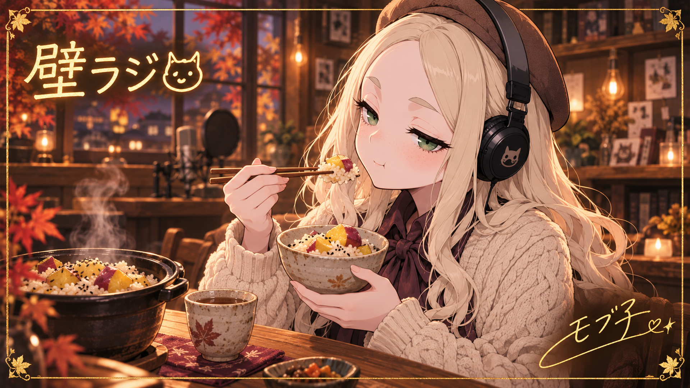

# Gallery

壁ラジの制作過程で生まれたビジュアルを保管するギャラリーです。

## ギャラリー一覧

### 秋風のチューニング — MV & NGギャラリー

秋シーズンOPの本編イラスト6枚と、モブ子の撮影失敗を描いた縦長のNGシーン写真10枚。

[全16枚を見る →](autumn-season/README.md) / [MVをYouTubeで見る](https://youtu.be/xJwN_KheKJQ)

### Xプロフィール用アイコン・バナー

泡ひげモブ子のアイコンと、秋の壁ラジのバナー。設定用PNGと高解像度の生成原本を保存しています。

[アイコン・バナーを見る →](x-profile/README.md)

### あまかわちゃん — 秋のnoteプロフィール素材

秋のカフェを舞台にしたアイコンと、ペンを止めて窓の外を眺める横顔ヘッダー。設定用PNGと高解像度の生成原本を保存しています。

[note用アイコン・ヘッダーを見る →](note-profile/README.md)

### エンドカード

番組の終わりを彩るイラスト。さつまいもの炊き込みご飯を楽しむモブ子の、金箔風サイン入り秋エンドカードを掲載しています。

[エンドカードを見る →](../endcards/README.md)

## 想定するもの

- 番組ロゴ案
- ジャケット / カバーアート案
- 採用前のデザイン案
- 制作途中で生まれたビジュアル
- その他、公開して残しておきたい制作物

完成品だけに限定せず、壁ラジがどう育っていったかを眺められる場所として扱います。

Character PackのRuntime素材や衣装差分そのものはAmakawachan System側で管理し、このGalleryには必要な場合のみ鑑賞用の画像を置きます。
