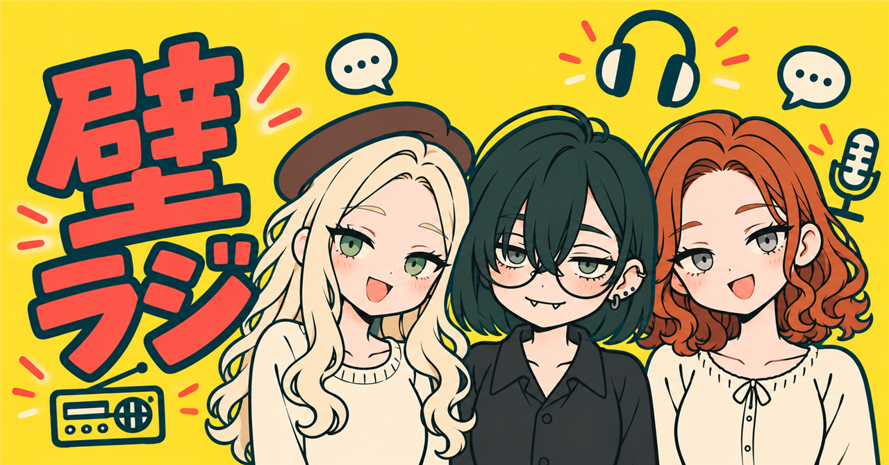
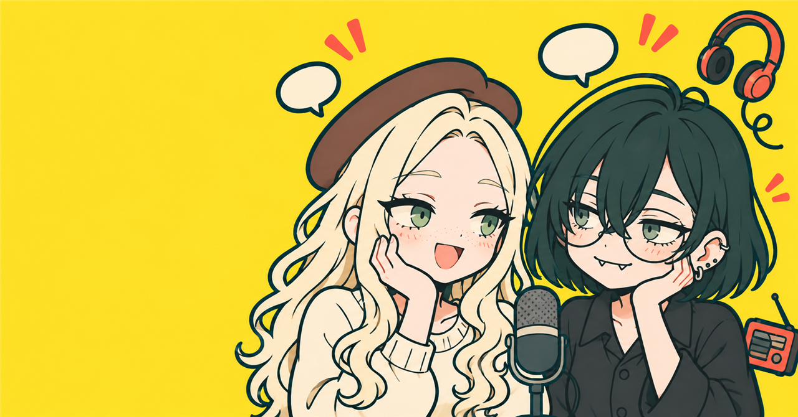
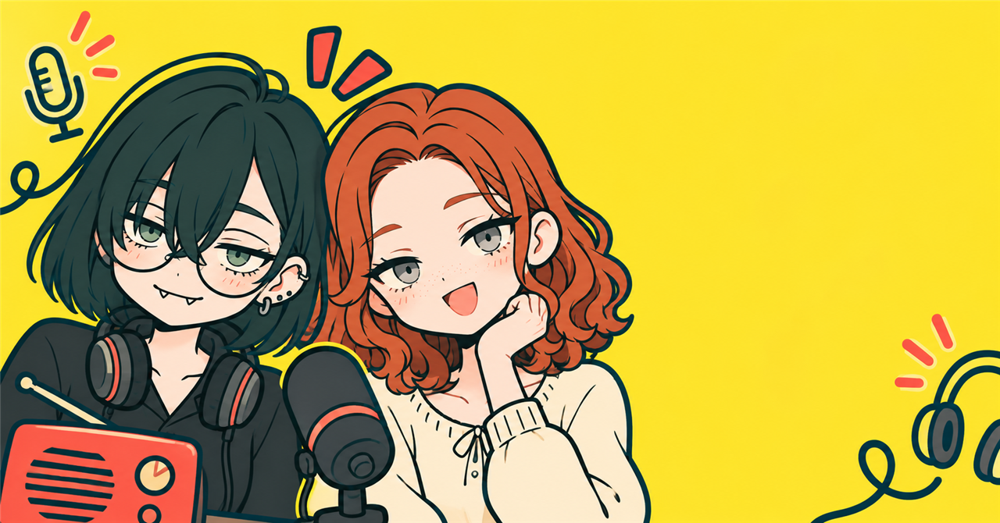
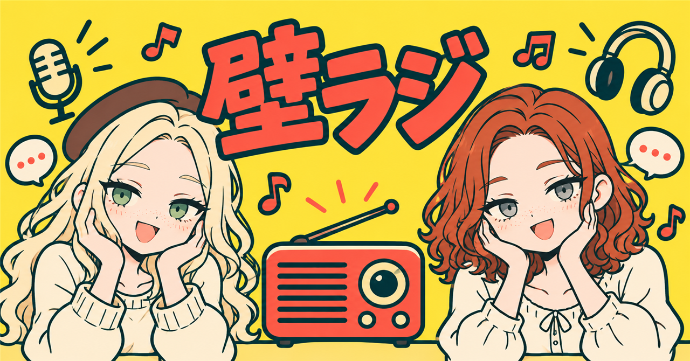
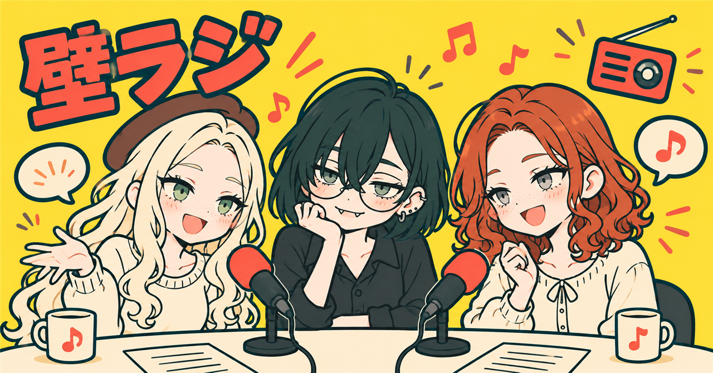
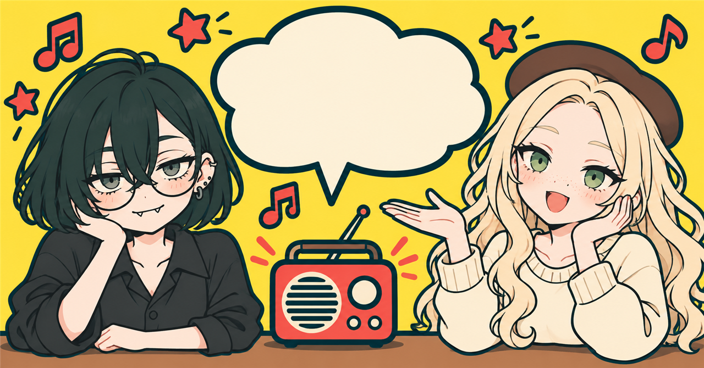
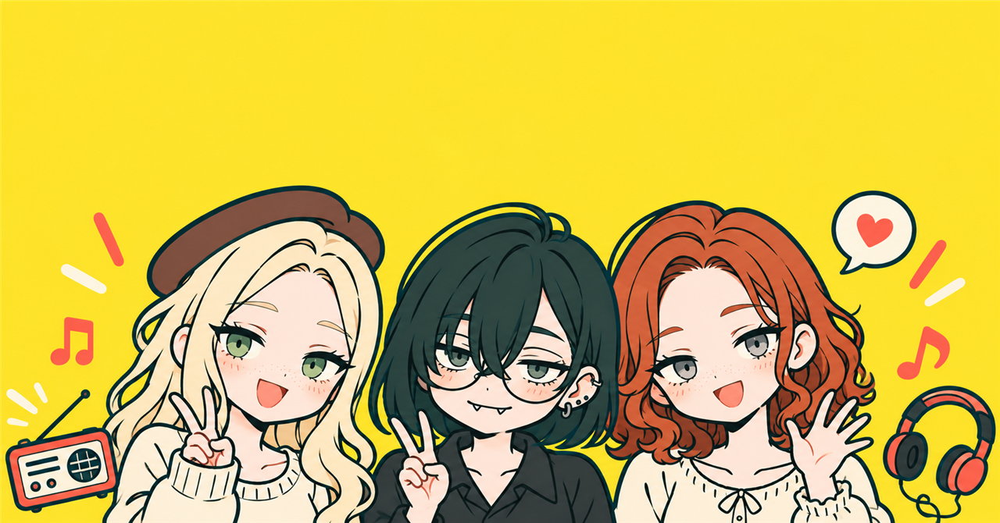

# note記事用 Pop見出し画像

同じ黄色・赤・濃緑のポップなテイストで制作した7パターン。設定用PNGは1280×670です。

## 3人集合

[設定用PNG](01_trio_1280x670.png) / [生成原本](01_trio_original.png)

壁ラジロゴ入り。

## あまかわちゃん＋モブコ

[設定用PNG](02_amaka_mobuko_1280x670.png) / [生成原本](02_amaka_mobuko_original.png)

左側に記事タイトル用の余白。

## あまかわちゃん＋モブ美

[設定用PNG](03_amaka_mobumi_1280x670.png) / [生成原本](03_amaka_mobumi_original.png)

右側に記事タイトル用の余白。

## モブコ＋モブ美

[設定用PNG](04_mobuko_mobumi_1280x670.png) / [生成原本](04_mobuko_mobumi_original.png)

壁ラジロゴ入り。

## 3人でラジオ収録

[設定用PNG](05_trio_recording_1280x670.png) / [生成原本](05_trio_recording_original.png)

## あまかわちゃんとモブコの掛け合い

[設定用PNG](06_duo_banter_1280x670.png) / [生成原本](06_duo_banter_original.png)

## 3人集合・上部にタイトル用余白

[設定用PNG](07_trio_title_space_1280x670.png) / [生成原本](07_trio_title_space_original.png)

[初回プロンプト全文](prompts.md) / [追加3枚のプロンプト全文](prompts-extra.md) / [Galleryに戻る](../README.md)

内蔵image_genで生成。原本を保持し、配布用のみリサイズ。[note公式の推奨サイズ](https://www.help-note.com/hc/ja/articles/360000231642)に合わせています。記事への投稿は行っていません。

