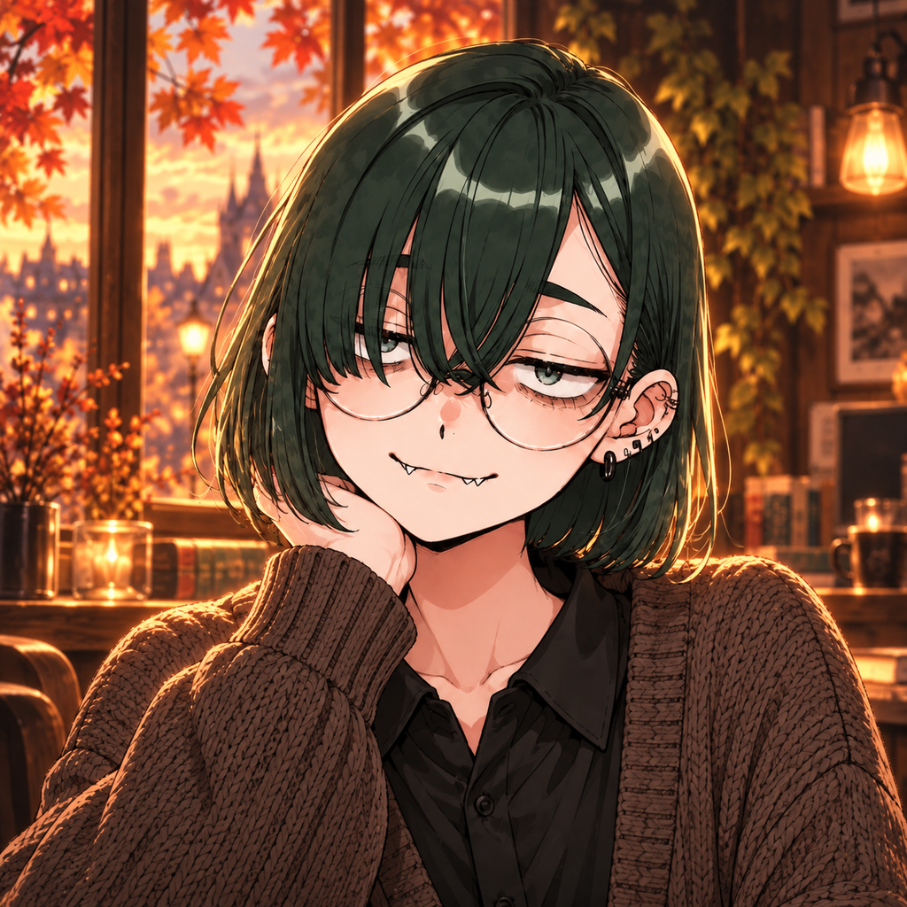

# あまかわちゃん — 秋のnoteプロフィール素材

壁ラジの秋の世界観に合わせた、あまかわちゃんのアイコンとヘッダーです。
黒緑のボブ、丸眼鏡、ピアス、ちらっと見える牙を残し、暖かなカフェの光と紅葉を合わせました。

## アイコン

[設定用PNG・1024×1024](amakawachan_autumn_icon.png) / [高解像度の生成原本](amakawachan_autumn_original.png)

## ヘッダー — 書きかけの秋

[設定用PNG・1920×1006](amakawachan_header_side_1920x1006.png) / [高解像度の生成原本](amakawachan_header_side_original.png)

ヘッダーには、ペンを止めて窓の外を眺める横顔の構図を採用しました。こちらを見るアイコンと組み合わせて使えます。

## 制作について

- あまかわちゃんの既存キャラクター素材をリファレンスに、AIによる画像生成・編集で制作しました。
- 設定用PNGは生成原本をリサイズしたものです。原本も編集用アセットとして保存しています。
- 文字なしの画像です。

[Galleryに戻る](../README.md) / [あまかわちゃんの紹介](../../../characters/amakawachan.md)
