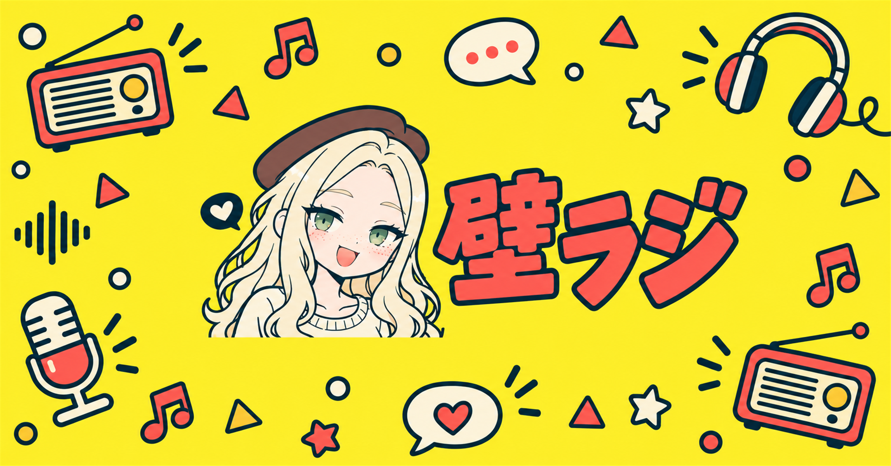
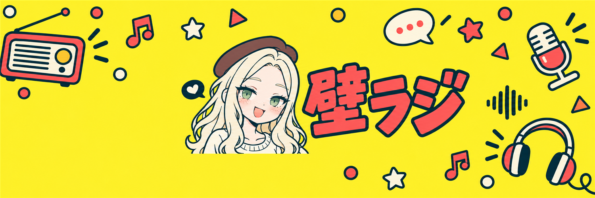
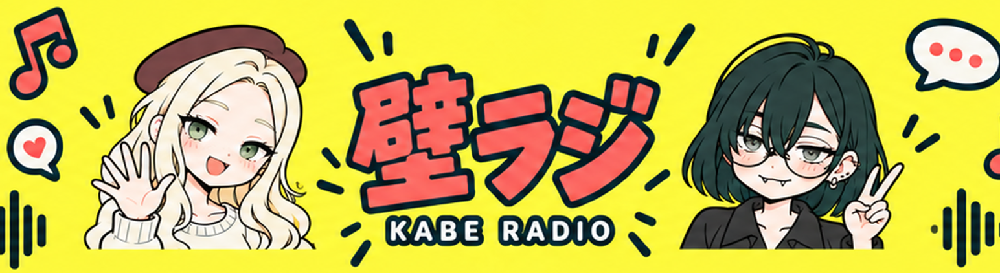
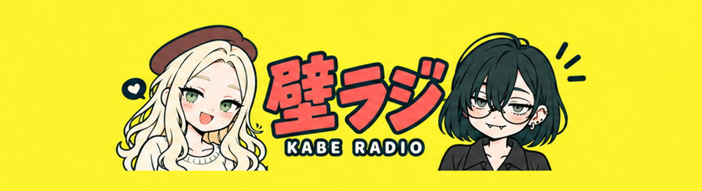
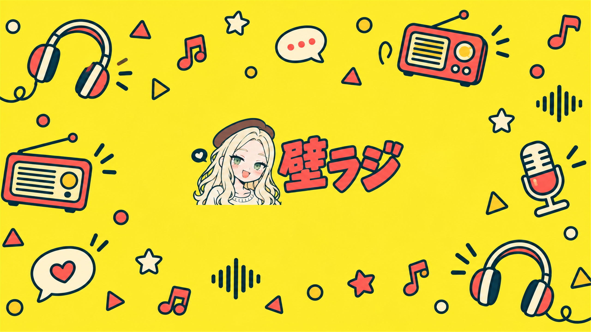
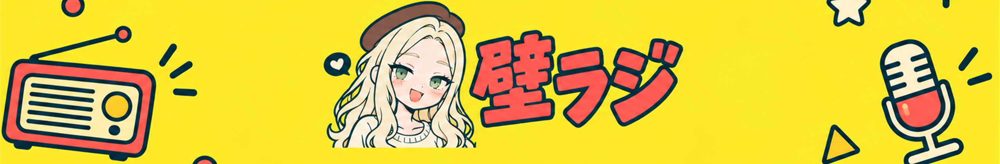
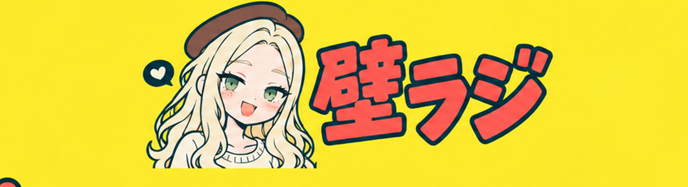

# 壁ラジ — Popアイコン・YouTube / note / X バナー

## あまかわちゃんアイコン

[800×800 PNG](amakawachan_icon_800.png) / [400×400 PNG](amakawachan_icon_400.png) / [生成原本](amakawachan_icon_original.png)

## モブ子 noteバナー

[1920×1006 PNG](mobuko_note_banner_1920x1006.png) / [生成原本](mobuko_note_banner_original.png)

## モブ子 Xバナー

[1500×500 PNG](mobuko_x_banner_1500x500.png) / [生成原本](mobuko_x_banner_original.png)

Xの左下はプロフィールアイコンと重なることを想定して余白を確保しています。各サービスへの設定は未実施です。

[今回のプロンプト全文](prompts-note-x-amaka.md)。既存案も引き続き保存しています。

黄色の背景、赤いロゴ、濃緑の太い輪郭線を使った、ポップな壁ラジのプロフィール素材です。[3人のカバー案](../spotify-cover/proposals/kaberadio_spotify_cover_proposal_gen_04_pop_trio.png)のテイストを引き継ぎました。

## モブ子アイコン

[設定用PNG・800×800](mobuko_icon_800.png) / [生成原本](mobuko_icon_original.png)

## YouTubeバナー

### 手の動き・装飾を追加した2人版

[アップロード用2560×1440](youtube_duo_motion_2560x1440.png) / [原本・案・プロンプト](youtube-duo-motion.md)

### 2人＋KABE RADIO版

[アップロード用2560×1440 PNG](youtube_duo_2560x1440.png) / [原本・制作案・プロンプト](youtube-duo.md)

### モブ子1人版

[アップロード用PNG・2560×1440](youtube_banner_radio_pattern_2560x1440.png) / [生成原本](youtube_banner_radio_pattern_original.png)

テレビ表示ではラジオ・マイク・ヘッドホン・吹き出しなどが画面全体を彩ります。PC表示では左右のラジオとマイクが見え、スマホ表示では中央のモブ子とロゴを中心に見せます。

中央の1544×422ピクセルを切り出した、スマホ表示範囲の目安：

アップロードにはプレビューではなく2560×1440版を使用してください。[YouTube公式の推奨サイズと表示範囲](https://support.google.com/youtube/answer/10456525?hl=ja)に合わせ、顔とロゴを中央へ収めています。実際のチャンネルへの設定は行っていません。

## プロンプト・制作記録

[カバー・アイコン・バナーのプロンプト全文](prompts.md)を保存しています。内蔵画像生成ツールで制作し、設定用画像は生成原本を指定寸法へリサイズしました。

[バナー初回案](youtube_banner_draft.png)も保存しています。初回案は中央の絵が大きかったため、表示範囲に収まるよう画像生成で縮小しました。

[黄色い背景だけの旧版](youtube_banner_2560x1440.png) / [旧版の生成原本](youtube_banner_original.png)も制作案として残しています。

[Galleryに戻る](../README.md)

