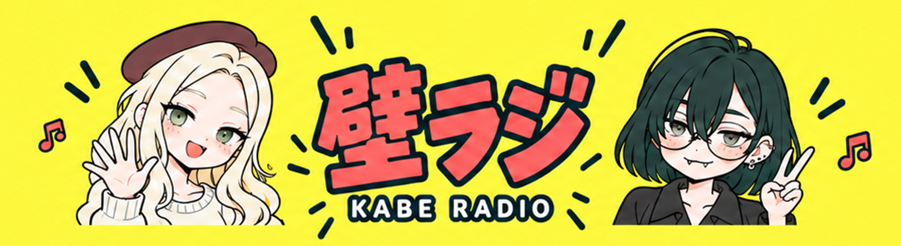

# モチーフを控えめにした2人バナー



[アップロード用2560×1440 PNG](youtube_duo_small_motifs_2560x1440.png) / [生成原本](youtube_duo_small_motifs_original.png)

キャラのポーズとロゴを残し、周囲のモチーフを縮小・整理。内蔵image_genで制作、設定用のみリサイズ。中央1544×422のプレビューを保存。旧案も保持。YouTubeへの設定は未実施。

## プロンプト全文

```text
Edit this finished 16:9 YouTube banner. Preserve EXACTLY the existing central Mobuko waving, Amakawachan peace sign, their positions and sizes, faces, hands, and the central 壁ラジ and KABE RADIO typography and size. Preserve yellow background and pop palette. ONLY reduce surrounding decorative motifs: make ALL radios, microphones, headphones, music notes, speech bubbles, stars, triangles and waveform symbols approximately HALF their current linear size. Remove about one third of them to reduce clutter. In the central mobile-visible horizontal band, retain only a few tiny coral music notes or short dark teal accent strokes next to the characters, none larger than one third of a character face; remove large side waveforms and large bubbles. Leave comfortable yellow negative space rather than filling every gap. On the outer TV canvas retain a balanced sparse scattering of small radio-themed icons, each secondary to the central portraits. CRITICAL: do not enlarge, shrink or shift central portraits or title. Their complete heads, hands and lettering remain in the same central mobile safe band. No extra text, no guides, no UI. Same simple cartoon style. Full 16:9 output.
```

