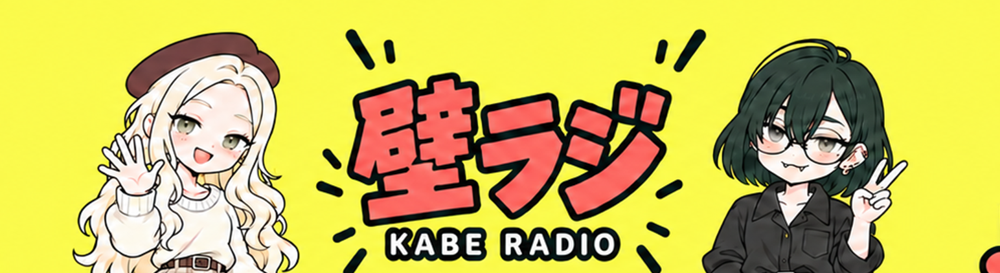

# ロゴ位置・余白調整版



[アップロード用2560×1440 PNG](youtube_fullbody_balanced_2560x1440.png) / [原本](youtube_fullbody_balanced_original.png)

ロゴを下げた版を元に、上側に音符・吹き出し、下側に星を追加。内蔵image_gen使用。配布用のみリサイズ。YouTubeへの設定は未実施。

[ロゴ位置調整の経緯・プロンプト](youtube-lower-logo.md)

## 余白調整プロンプト

```text
Refine decoration ONLY in this full 16:9 YouTube banner. Keep both characters and entire 壁ラジ / KABE RADIO logo EXACTLY at current positions and sizes, especially keep the lowered logo. Fill the large empty upper-central yellow gap above the logo with a small balanced cluster of radio-themed accents: one small coral music note, a small cream speech bubble and 2 short dark teal sound strokes around x=40%..60%,y=25%..34% of canvas. Each motif no more than 4% canvas width. Add one small coral star in the empty lower-center area between the figures around x=50%,y=72%, well separated from existing waveform. Preserve generous breathing space: do not add anything in central horizontal band y=36%..65% or overlap heads, hands or lettering. All existing motifs stay unchanged. Same simple pop palette and outlines. No new text. No character or logo movement. Finished image only.
```

