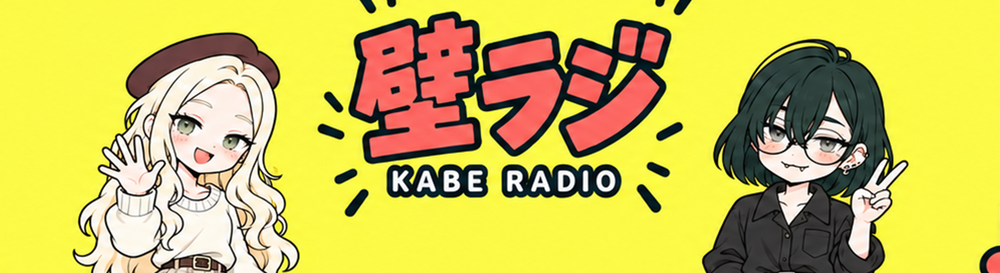

# テレビで全身・スマホで横長バナーの2人版



[アップロード用2560×1440 PNG](youtube_fullbody_2560x1440.png) / [生成原本](youtube_fullbody_original.png) / [調整前案](youtube_fullbody_draft.png)

テレビでは全身、中央1544×422のスマホ切り抜きでは顔・手・ロゴを表示する構図。従来のにぎやかなモチーフを基準に8割程度のサイズを指定。衣装の下半身は本案向けの提案。内蔵image_genで制作。旧案も保持。YouTubeへの設定は未実施。

## プロンプト全文

```text
Redesign this YouTube banner with a smart dual-purpose composition: on TV full-body mascot characters, on MOBILE a perfect narrow face-and-logo banner. Keep SAME simple pop cartoon identities, NOT detailed anime rendering. Full 16:9 canvas ideally 2560x1440. Continuous sunflower yellow background, coral red cream dark teal palette. Place TWO FULL BODY characters standing at left and right of center: Mobuko left (long blonde waves brown beret green eyes freckles cream sweater, cream/brown simple skirt and brown ankle shoes), Amakawachan right (dark green-black bob round glasses gray-green eyes tiny fangs ear piercings black collared shirt, charcoal loose trousers and dark shoes). Cute compact cartoon proportions, about 3 heads tall. Their HEADS MUST sit at canvas mid-height, NOT top: entire beret/hair/face fit between y=545 and y=830 on 2560x1440 canvas. Raised waving hand of Mobuko and peace sign of Amakawachan beside their faces, fully within y=560..870. Shoulders around y=830. Their bodies extend DOWN below the central mobile crop toward y=1310, shoes entirely visible with bottom margin. Mobuko head around x=790, Amakawachan head around x=1790. Important mobile content inside x=550..2010,y=540..900: faces, raised hands, exact title 壁ラジ and subtitle KABE RADIO. Title centered x=1030..1540,y=600..795, English below y=825..870. On MOBILE crop only their heads, hands and upper shoulders appear, exactly like a horizontal banner. On TV show full standing bodies below while upper third contains lively small radio-themed graphics. Reference has oversized motifs: keep its playful count and density but reduce individual icons to 80% its size, never bigger than a character head. Arrange radios, headphones, microphones, speech bubbles, notes and graphic triangles around perimeter and upper/lower spaces, avoid face/title overlap. Professional VTuber ensemble channel-art composition using full-body mascots anchored under a central safe band, but original supplied character designs only. Head position and safe band mandatory. No crop guides, no mockup, no extra text, no other characters. Keep faces and title as stars, simple bold cartoon linework.
```

## 表示範囲の調整

```text
Edit this exact full-body banner. Keep title and all decorations unchanged. Resize BOTH full-body characters to 82% current height and width, anchored at their shoe positions (bottom y=96%). This MUST move top of Mobuko beret from y=28% down to y=40% canvas height, and Amakawachan hair from y=30% to y=42%. Heads and raised hands then fit within central horizontal mobile crop y=35.4%..64.6%. Preserve their full-body poses and identities and visible shoes, do not crop or remove bodies. Fill vacated areas with yellow. Keep horizontal centers unchanged. Main title and KABE RADIO remain at same position. 16:9 full canvas.
```

