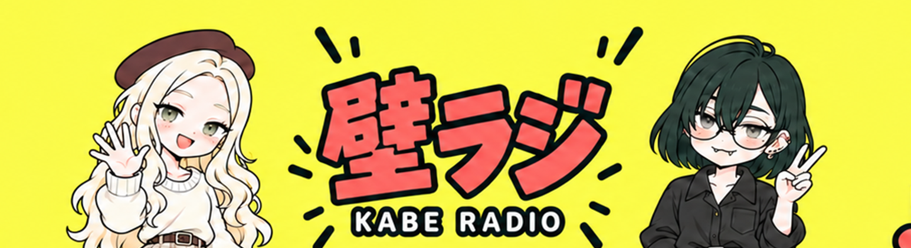

# ロゴ位置を下げた全身版



[設定用2560×1440](youtube_fullbody_lower_logo_2560x1440.png) / [原本](youtube_fullbody_lower_logo_original.png)

[調整案1](youtube_lower_logo_draft1.png) / [調整案2](youtube_lower_logo_draft2.png)

内蔵image_genで編集。配布用のみリサイズ。YouTubeへの設定は未実施。

## プロンプト1

```text
Make one precise edit to this YouTube banner: move the central lettering group consisting of 壁ラジ and KABE RADIO and its adjacent short accent strokes DOWN by 65 pixels on a 2560x1440 canvas (4.5% canvas height). Preserve its horizontal position, size, exact spelling and appearance. Its top should now have comfortable clearance inside central mobile band; entire title/subtitle must fit y=580..890. Fill vacated location with matching yellow. Keep both full-body characters, faces, poses, hands, clothing, shoes and ALL other surrounding motifs and full 16:9 composition unchanged. Do not resize or shift the entire canvas. Only reposition central logo group down. No new elements.
```

## プロンプト2

```text
Correct ONLY central logo position: it was moved too far down. Move entire 壁ラジ + KABE RADIO + accent strokes UP slightly so group vertical CENTER is exactly 50% of full canvas height. The lettering itself must span y=41%..60% of full image, with KABE RADIO baseline at y=60%. Keep size unchanged. In this 1672x941 reference, Japanese top should be y=385 and English bottom y=565, NOT current y=480..655. All characters and background must stay identical. 16:9.
```

## プロンプト3

```text
Image 1 is the BASE image. Preserve image 1 exactly, especially BOTH CHARACTERS and ALL BACKGROUND. Image 2 is only a reference for the desired CENTRAL LETTERING POSITION. In image 1 move ONLY 壁ラジ and KABE RADIO slightly down to match image 2's title position. Do NOT use image 2 character positions: its characters were accidentally shifted upwards. Keep image 1 characters at their ORIGINAL position with beret top at 39% canvas height, shoes at 92%. Only central lettering should change, moving down approximately 2.5% canvas height. Keep size and composition otherwise identical to image 1. Output full 16:9.
```

