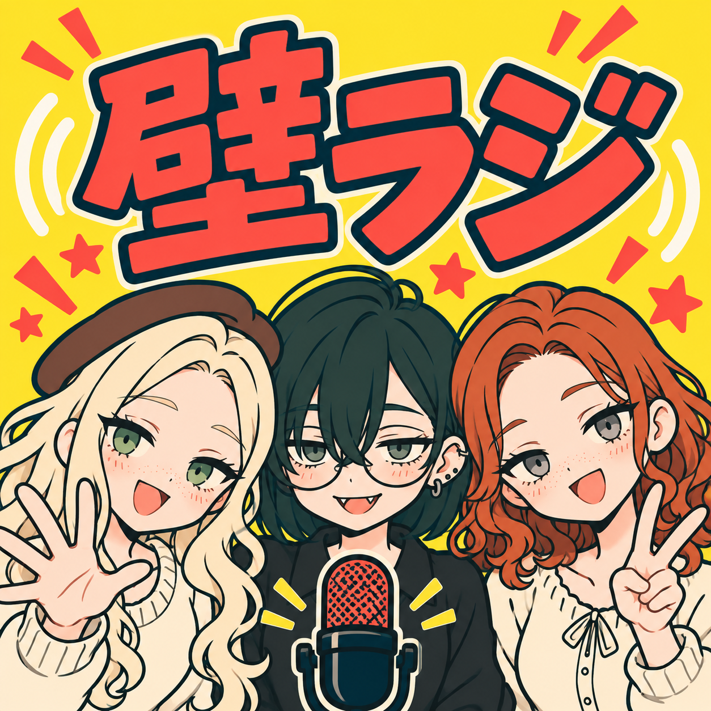

# 動きのある3人のPodcastカバー

2026-09-28。内蔵image_genで制作。既存のポップな3人カバーをキャラクターと画風の参照に、ユーザー提供の写真1〜3を配置・ポーズの参考に使用。



[3000×3000 PNG](kaberadio_dynamic_trio_3000.png) / [生成原本](proposals/kaberadio_spotify_cover_proposal_gen_05_dynamic_trio.png)

3000px版は生成原本の拡大書き出しです。旧案は保存しています。配信サービスの画像変更は未実施。

## プロンプト全文

```text
Create one finished SQUARE podcast cover for 壁ラジ. Image 1 is the PRIMARY style and character-identity reference: preserve its simple pop cartoon treatment, thick dark teal outlines, flat sunflower yellow, coral red and cream palette. Images 2-4 are COMPOSITION AND ENERGY references only: big bold title across upper 40%, three close cheerful characters leaning together below, lively gestures and head tilts, microphone at lower center. Do not adopt their detailed glossy anime rendering or change character identities to theirs. Exact main text 「壁ラジ」 in huge coral red dark teal outlined chunky lettering, slightly tilted upward, fully readable within generous edge margins, small cream offset outline. No English subtitle or other text. Mobuko LEFT: blonde long wavy hair, BROWN BERET, green eyes, freckles, cream sweater; lean inward and wave one open hand toward viewer. Amakawachan CENTER: dark green-black short bob, ROUND GLASSES, sleepy gray-green eyes, tiny fangs, several ear piercings, BLACK COLLARED SHIRT; playful small grin, slightly tilted head and relaxed posture. Mobumi RIGHT: auburn shoulder-length loose curls (not tied up), pale gray eyes, freckles, cream ribbon-neck blouse; lean inward with cheerful smile and one peace sign. Preserve recognizability from image 1. Heads at different heights in a lively triangular group, faces large, no face covered by hands or microphone. One simplified dark teal/coral microphone at bottom center, few sound-wave arcs and coral spark shapes around title, ample yellow breathing room. Keep design simple and readable at tiny podcast thumbnail scale. Flat limited shading, no elaborate scenery, no glossy hair, no 3D text, no complex textures, no border, no extra people. Output a square image.
```

