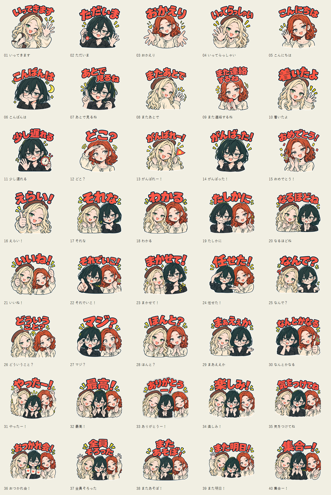

# 壁ラジPOP Vol.1 — 完成版

状態: 2026-09-28、ユーザー了承により現行40枚とmain・tabを完成版として確定。制作指示は production-v2.json、修正指示は corrections.json、制作記録は PRODUCTION.md。LINEへの申請は未実施。

[販売ページ用文面と入稿メモ](RELEASE.md) / [完成版ファイル記録](release.json)

## 制作画像

- [40枚一覧](contact-sheet.png)
- [背景を切り替えられるプレビュー](preview.html)
- [40枚＋main・tabのZIP](kaberadio-pop-vol1-40.zip)
- [制作プロンプト](production-v2.json) / [文字修正プロンプト](corrections.json)
- [書き出し確認結果](export-check.json)

## 方針

今のPOPカバーの顔・太い濃緑線・赤/クリーム/黄色を継承。背景は透過し、黄色は小さなアクセントに限定。1人16枚、2人14枚、3人10枚。2人は説明役と反応役を分け、3人は胸上の三角配置を基本にする。バナーの全身構図は縮小すると顔が小さくなるため流用しない。

文字は上部の大きな1〜2行、顔や手に重ねない。長い文言は改行で対応し、文字を縮めて押し込まない。濃緑の太字と白い外縁を基本に、赤は強調に使う。装飾は0〜1個。試作で文字が崩れる場合は絵と文字を分けて組む。

## 重複確認の範囲

参照: extras/line-stickers.md、extras/line-stickers-catalog.md、wallradio-screenshot-a.yaml、wallradio-screenshot-b.yaml、関連repo amakawa-chan/mobuko-line-stickers/manifest.yaml（GitHubから取得し文言・用途・構図を確認）。当初はAが40件、Bが27件のみ判読できたが、ローカルの制作元を発見しBも40件を補完済み（../local-source-discovery.md）。A/Bと正式Vol.1/2の対応は仮置き。未確認箇所を未使用と断定しない。

確認済み文字列との完全一致は今回案にはないが、語尾違いや意味重複はある。特に33のお礼は意図的に残す。各行のnotesに近似用途と差別化を記録。既存モブ子セットの開発・散財・天然煽りネタは今回追加しない。

## Issue候補からの変更提案

- 11 いま行く → 少し遅れる：既存の移動開始連絡を避ける。
- 34 おめでとうー！ → 楽しみ！：15との重複を減らす。
- 35 いってらっしゃーい！ → 気をつけてね：04との重複を減らす。
- 36 おかえりー！ → おつかれ会！：03と用途を分け、グループで誘う用途へ。
- 37 大集合！ → 全員そろった：40の招集と、集合完了を分ける。

## 40枚の構成

| ID | 文言 | キャラ | 用途 | 構図 |
|---|---|---|---|---|
| 01 | いってきます | モブ子 | 外出の挨拶 | 肩掛け鞄で手を振り、一歩踏み出す |
| 02 | ただいま | あまかわちゃん | 帰宅報告 | 鍵を持ち、肩の力を抜いて片手を上げる |
| 03 | おかえり | モブ美 | 帰宅した相手を迎える | 胸上で両手を広げる |
| 04 | いってらっしゃい | モブ子 | 出発する相手を送る | 少し身を乗り出し大きく手を振る |
| 05 | こんにちは | モブ美 | 昼の挨拶 | 顔の横で小さく手を振る |
| 06 | こんばんは | あまかわちゃん | 夜の挨拶 | 頬杖と控えめな笑顔、小さな月 |
| 07 | あとで見るね | あまかわちゃん | 今すぐ内容を確認できない | 伏せたスマホを脇に持ち指を一本上げる |
| 08 | またあとで | モブ子 | 一時的に会話を離れる | 振り返りながら片手を振る |
| 09 | また連絡するね | モブ美 | 次の連絡を約束 | スマホを胸元に持ちうなずく |
| 10 | 着いたよ | モブ子 | 待ち合わせ場所への到着 | 小さな位置ピンと顔、片手を上げる |
| 11 | 少し遅れる | あまかわちゃん | 遅刻の事前連絡 | 小さな時計と申し訳なさそうな片手 |
| 12 | どこ？ | モブ美 | 待ち合わせ相手を探す | 額に手を当て左右を見る |
| 13 | がんばれー！ | モブ子 | 相手への応援 | 小さな旗を振り拳を握る |
| 14 | がんばった！ | あまかわちゃん | 自分の達成を報告 | 小さくガッツポーズ、得意な笑顔 |
| 15 | おめでとう！ | モブ美 | 相手への祝福 | 両手で拍手、小さな紙吹雪 |
| 16 | えらい！ | モブ子 | 相手の努力を認める | 大きな親指と笑顔 |
| 17 | それな | あまかわちゃん・モブ子 | 強い共感 | あまかわが相手を指さし、モブ子が深くうなずく |
| 18 | わかる | モブ子・モブ美 | 気持ちへの共感 | 顔を近づけ、片方は胸に手、片方はうなずく |
| 19 | たしかに | あまかわちゃん・モブ美 | 説明への納得 | あまかわは顎に手、モブ美は人差し指を上げる |
| 20 | なるほどね | あまかわちゃん・モブ子 | 新しい説明の理解 | モブ子が手で説明し、あまかわに小さなひらめき線 |
| 21 | いいね！ | モブ子・モブ美 | 提案への好意 | 2人が異なる高さで親指を上げる |
| 22 | それでいこ！ | あまかわちゃん・モブ美 | 案を決定する | あまかわが前を指しモブ美が小さく拳を上げる |
| 23 | まかせて！ | あまかわちゃん・モブ子 | 引き受ける | あまかわが胸を叩きモブ子が期待して見上げる |
| 24 | 任せた！ | モブ美・あまかわちゃん | 役割を託す | モブ美が手のひらであまかわを紹介、あまかわが敬礼 |
| 25 | なんで？ | モブ子・あまかわちゃん | 理由を尋ねる | モブ子が首を傾げ、あまかわが肩をすくめる |
| 26 | どういうこと？ | モブ美・モブ子 | 状況の説明を求める | 2人が逆方向に首を傾げ中央に小さな疑問符 |
| 27 | マジ？ | あまかわちゃん・モブ美 | 驚きの反応 | あまかわが眼鏡を押さえモブ美が目を丸くする |
| 28 | ほんと？ | モブ子・モブ美 | 期待しながら確認 | モブ子が身を乗り出しモブ美が胸元で手を組む |
| 29 | まあええか | あまかわちゃん・モブ子 | 小さな問題を流す | あまかわが両手を軽く広げモブ子が笑う |
| 30 | なんとかなる | モブ美・あまかわちゃん | 不安を和らげる | モブ美が親指を上げ、あまかわが肩の力を抜く |
| 31 | やったー！ | モブ子・あまかわちゃん・モブ美 | 共同の成功 | 3人が三角配置で拳や両手を上げる |
| 32 | 最高！ | モブ子・あまかわちゃん・モブ美 | 強い好評価 | 3人の顔を寄せ、親指とピース |
| 33 | ありがとうー！ | モブ子・あまかわちゃん・モブ美 | みんなからのお礼 | 3人が高さをずらし軽くお辞儀、手を胸元へ |
| 34 | 楽しみ！ | モブ子・あまかわちゃん・モブ美 | 予定への期待 | 中央あまかわの両側から2人が身を乗り出す |
| 35 | 気をつけてね | モブ子・あまかわちゃん・モブ美 | 移動や外出への気遣い | 3人がやさしく手を振り、モブ美は胸に手 |
| 36 | おつかれ会！ | モブ子・あまかわちゃん・モブ美 | 作業後の集まりへの誘い | 3人が小さなマグを中央へ寄せる |
| 37 | 全員そろった | モブ子・あまかわちゃん・モブ美 | 集合完了の報告 | 3人が肩を寄せて片手を上げる |
| 38 | またあそぼ！ | モブ子・あまかわちゃん・モブ美 | 次の遊びへの誘い | 左右の2人が手を振り中央がピース |
| 39 | また明日！ | モブ子・あまかわちゃん・モブ美 | 翌日の再会 | 3人が違う高さで手を振る |
| 40 | 集合ー！ | モブ子・あまかわちゃん・モブ美 | 集まるよう呼びかける | 中央あまかわが口に手を添え、左右が手招き |

## 制作ファイル

[manifest.json](manifest.json)に全40件のid / text / category / usage / characters / composition / tone / notesと、各画像の独立した生成プロンプトを収録。main/tabの案・プロンプトも同ファイルに収録。

命名: originals/01_v01.png（生成原本）、output/01.png〜40.png（配布用）、output/main.png、output/tab.png。修正版は原本のv番号を増やす。contact-sheet.pngは生成後に5列×8行、IDと文言付きで作成する。実際の採用原本は originals/01.png〜40.png。差し替え前の原本は *_draft_*.png として保存。

## 先行試作のおすすめ

10「着いたよ」（1人）、17「それな」（2人）、31「やったー！」（3人）の3枚で顔・文字・人数による見え方を揃える。その後7〜9の長めの文字で可読性を見てから40枚へ展開。生成には内蔵image_genを使いtransparent_background=trueを指定する。

## 出力仕様と制作時の確認事項

スタンプ370×320、main240×240、tab96×74の透過PNG。LINE公式ではスタンプ寸法は最大370×320、各1MB以下、偶数寸法、RGB・72dpi以上。最終出力時に容量・透過・外周余白と、明暗の背景で文字/顔を確認する。[LINE公式ガイド](https://creator.line.me/ja/guideline/sticker/)

## レビュー項目

上記5件の文言差し替え、3人10枚の割合、mainの3人/ tabのあまかわちゃん単独を提案。B未確定13件はローカル制作元により照合済み。訂正内容は PRODUCTION.md を参照。

本作業は独立した制作設計資料のため通常ランチャーの確認・反映対象外。コードや起動動作は変更しない。

